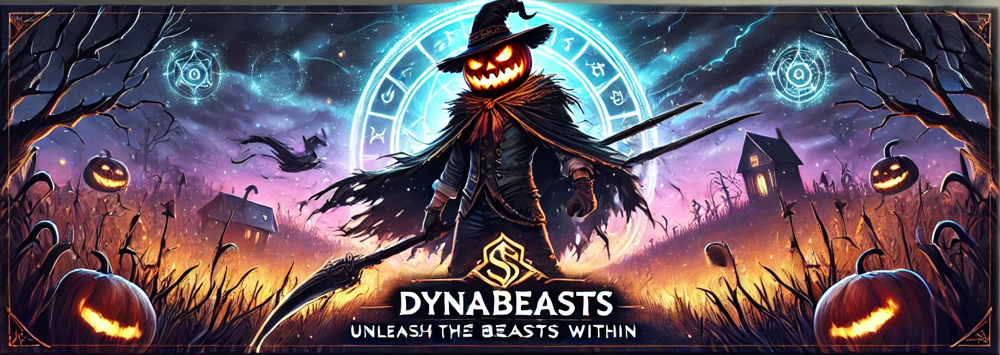

# 🐾 Dynabeasts: O Futuro dos Jogos de Criaturas



**Dynabeasts** é um jogo 2D multiplataforma que reimagina os jogos de batalhas de criaturas e exploração com duas mecânicas únicas:  
- ⚔️ **Batalhas Competitivas** inspiradas em Street Fighter.  
- 🗺️ **Exploração Dinâmica** no estilo de moba.

🎯 **Objetivos**: 
- Criar uma aventura instigante de mundo aberto
- batalhas estratégicas e divertidas, onde habilidade é mais importante que sorte.
- jogo com `NFT` e `criptomoedas` com mercado e competições entre os outros jogadores  

---

## 🌟 Características Principais
- **Duas mecânicas de batalha**: Exploração em tempo real e combates competitivos 2D.  
- **Mundos baseados em países reais**, com inspiração na cultura e história.  
- **Criação aberta**: Código disponível para colaboração e evolução da comunidade.  
- **Suporte multiplataforma**: Disponível para dispositivos móveis e computadores.

---

## 📸 Imagens e Protótipos

*Capturas de tela ou GIFs de protótipos aqui.*

---

## 🚀 Status do Projeto
- **Fase atual**: Documentação e escolha de tecnologia.  
- **Próximos passos**: Desenvolver protótipo inicial e coletar feedback.  

---

## 📖 Documentação Completa
Acesse os detalhes técnicos e a visão completa do projeto:  
- 📘 [Mecânicas e Sistemas](./docs/features.md)  
- 📘 [Licença e Contribuições](./docs/license.md)  

---

## 🤝 Como Contribuir
1. Clone o repositório:  
   ```bash
   git clone https://github.com/seu_usuario/dynabeasts.git
